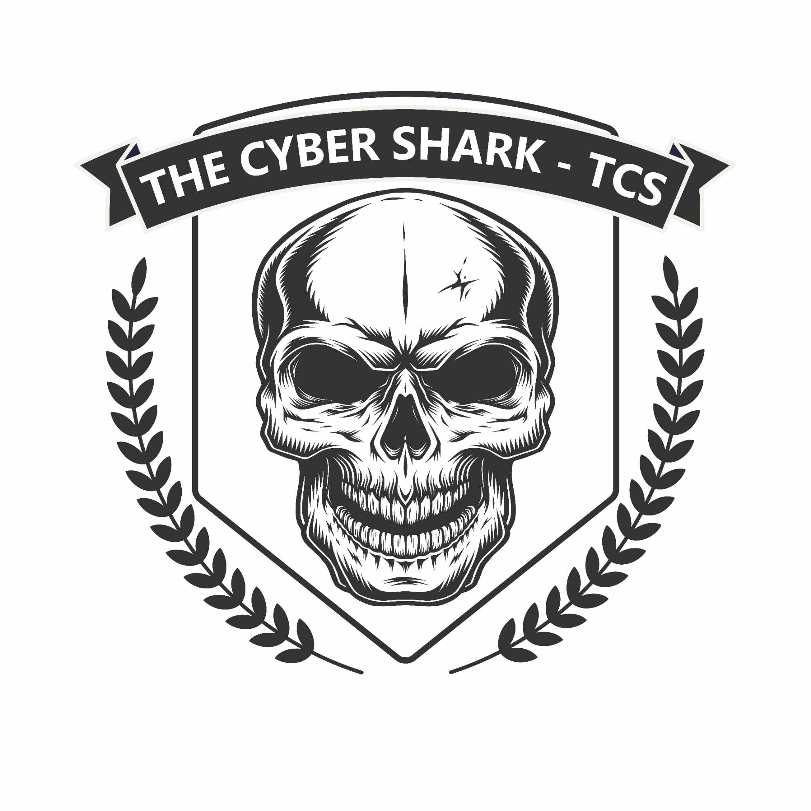

  

<h1 align="center">The Cyber Shark - TCS 🦈</h1>

### _“Any illegal activity will be stopped forever if you fall into our target, so beware-!”_ 🧑‍💻💀

---

## 🦈 Welcome to The Cyber Shark - TCS

**The Cyber Shark (TCS)** is a powerful alliance of **ethical hackers** and **ethical spammers**. We operate with precision, not for chaos, but for **protection**. We live in the shadows of the digital world to expose and eliminate threats before they harm others.

**Mission**: Our primary goal is to **combat cybercrime**, raise awareness, and provide **online security solutions** for those in need. Whether it’s safeguarding your digital life or eliminating malicious elements from social media platforms like Facebook, we’ve got you covered!

---

## 🖥️ Our Expertise

- **Ethical Hacking** 🧑‍💻: We specialize in **white-hat hacking** practices to identify vulnerabilities, secure systems, and protect online communities from hackers and cybercriminals.
  
- **Spamming** 📨: The **good kind**! We spread awareness about online scams, cyber threats, and teach people how to defend themselves against malicious hackers, primarily in **Facebook communities**.

- **Security Consulting** 🔐: Whether you're an individual or a business, we offer guidance on how to **fortify your digital assets** and safeguard your online identity.

---

## 🧑‍💻 Team TCS Admins

Here are the key members behind **The Cyber Shark - TCS**:

1. **[Mehedi Chowdhury](https://www.facebook.com/This.is.officials.account.CEO.at.TCS.Oky)** - CEO & Founder  
2. **[Limon Chowdhury](https://www.facebook.com/profile.php?id=100001157947500)** - Co-Founder  
3. **[Rifat Molla](https://www.facebook.com/rifatmolla143)** - Moderator  
4. **[Albert Hridoy](https://www.facebook.com/CYBER.HRIDOY.FACEBOOK.OFFICIAL.ACCOUNT.007)** - Controller  
5. **[Black Tiger](https://github.com/rabinasiyam)** - Programmer  
6. **[Sobuj](https://www.facebook.com/YOUR.NEXT.PAPAH.DARK.SHADOW.YOUR.ABBU)** - Web Expert  
7. **[Ariyan Islam Nahid](https://www.facebook.com/profile.php?id=100001157947500)** - Programmer  

---

## 🌐 Join Us on Facebook

We engage with our growing community on **Facebook**, offering advice, help, and support for online safety. Join our group, and let’s make the internet a safer place for everyone.

🔗 [Join Our Facebook Group](https://facebook.com/groups/1489853688323218/)

---

## 🚨 **Warning**:

Any malicious or illegal activities that target innocent people, violate online privacy, or spread harm will not be tolerated. **We are always watching**, and if you engage in such acts, you **will become our next target**. **TCS** makes sure that **cybercriminals** face **serious consequences**.

**⚠️ BEWARE** ⚠️: You do not want to end up on **The Cyber Shark's** radar. **We bite back.**

---

## 📂 Our Projects

Explore our open-source projects, where we share tools, scripts, and educational content designed to enhance **cybersecurity knowledge**:

- **[IP-Info-Extention](https://github.com/rabinasiyam/IP-Info-Extension)** - Get detailed insights into websites instantly. IPv4, IPv6, ISP, domain, and your IP address. Enhance browsing with IP Info Extension!

---

## 🌟 Contribute to TCS

Interested in contributing? We always welcome other **ethical hackers**, **security enthusiasts**, and **digital defenders** to join us in the fight for a safer internet. 

- **Fork this repository**, create a new branch, and submit a **pull request**.
- Share your thoughts, ideas, and expertise with us! Let's collaborate and strengthen online defenses.

---

## 📫 Contact Us

For inquiries, collaboration requests, or help, feel free to reach out:

- **Email**: [thecybershark@proton.me](mailto:thecybershark@proton.me)  
- **Facebook Group**: [The Cyber Shark - TCS](https://facebook.com/groups/1489853688323218/)  
- **Report a Cybercrime**: [Report Here](mailto:thecybershark@proton.me)

---

## 🔒 Disclaimer

**The Cyber Shark - TCS** does not endorse or participate in any illegal activities. Our mission is strictly limited to **ethical hacking**, **online protection**, and **cybersecurity awareness**. Any illegal activity reported to us will be investigated and, if necessary, escalated to the relevant authorities. **We are here to protect, not to harm**.

---

> ### 🦈 _The Cyber Shark bites back!_
> Any illegal activity will be stopped forever if you fall into our target, so beware-! 
